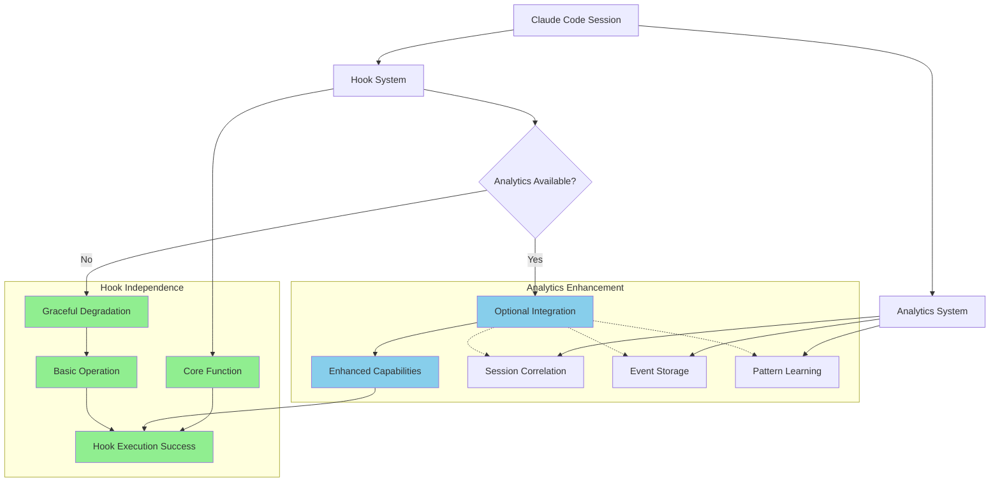
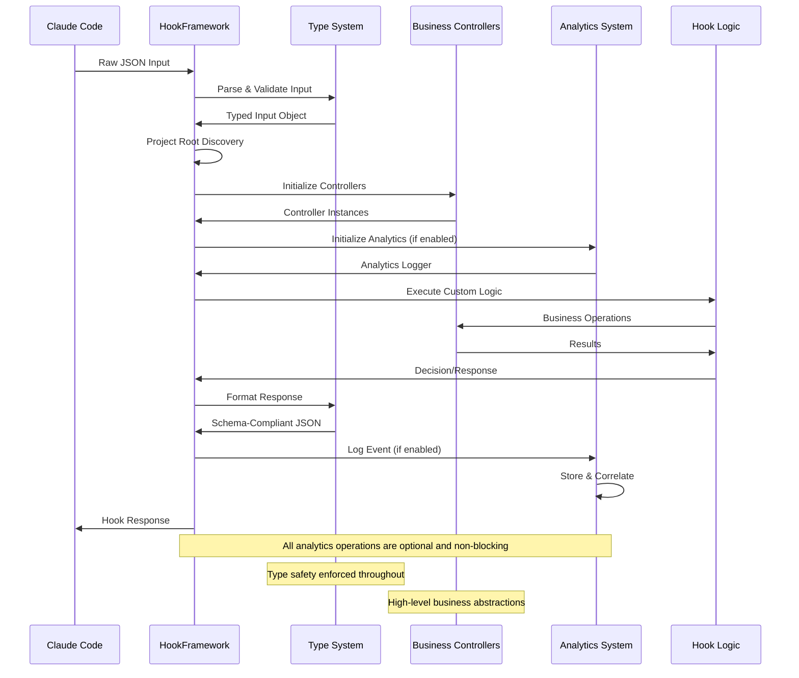
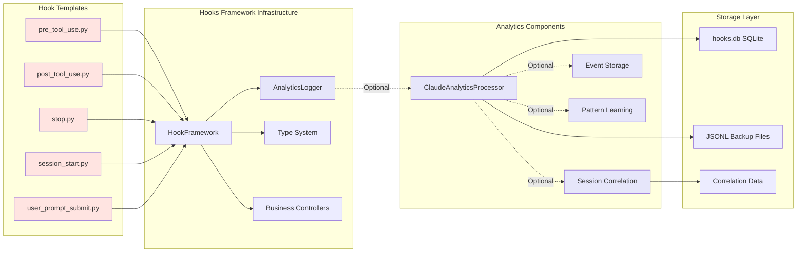
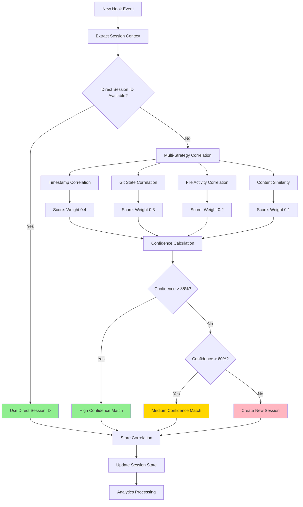
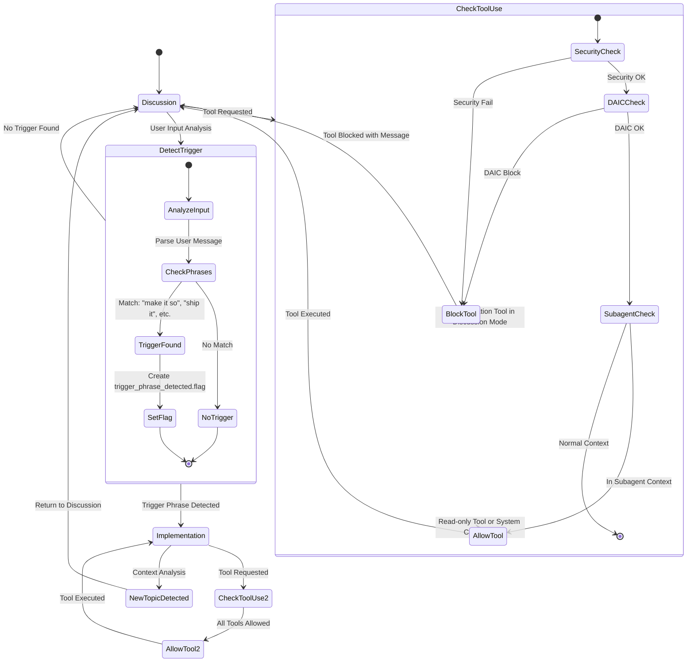
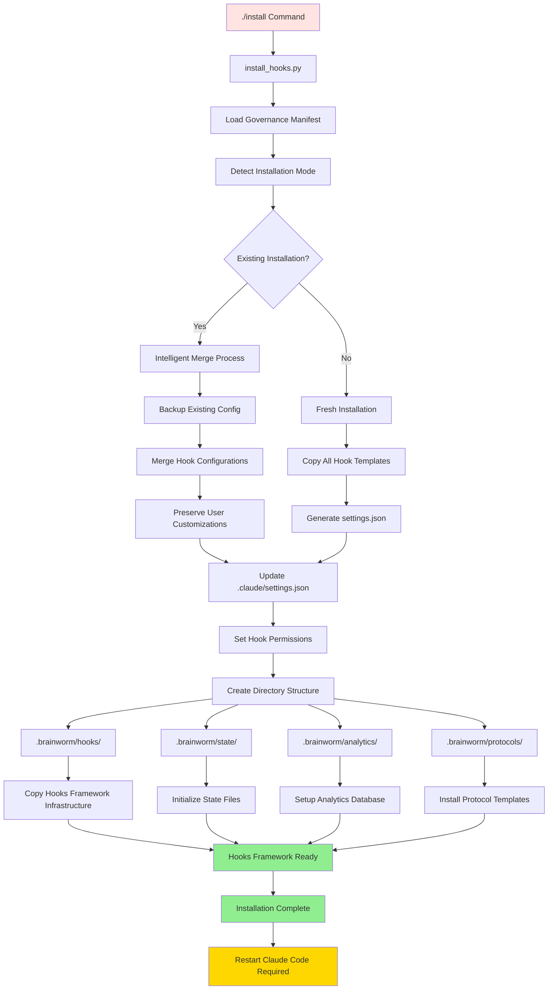
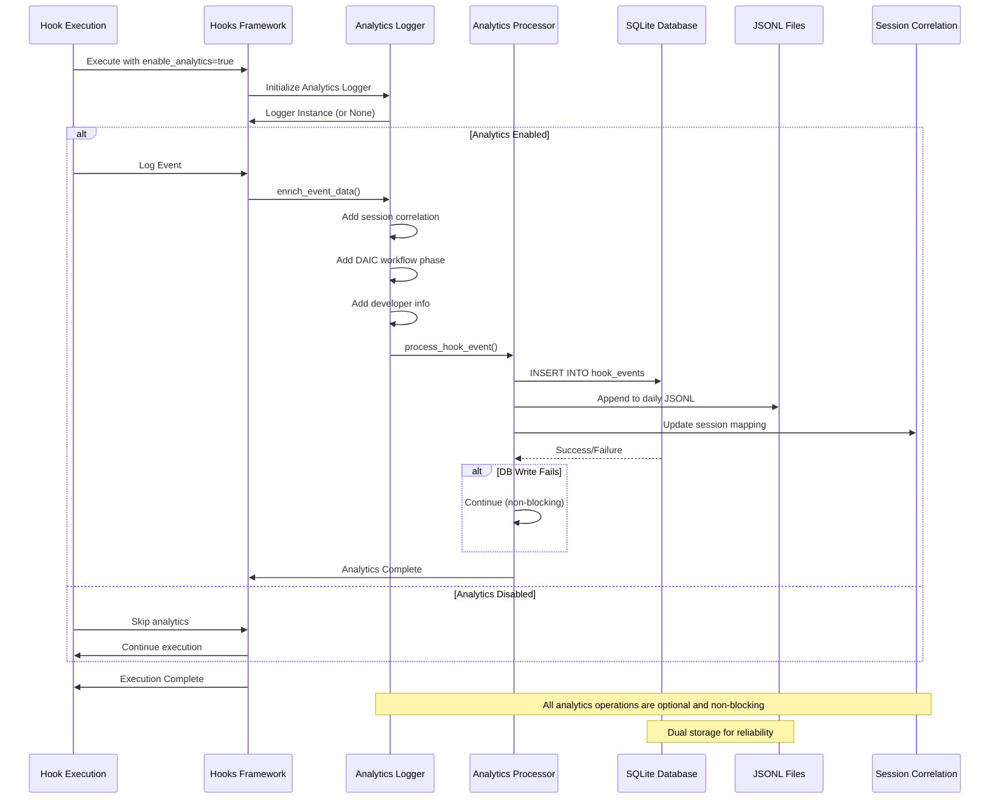
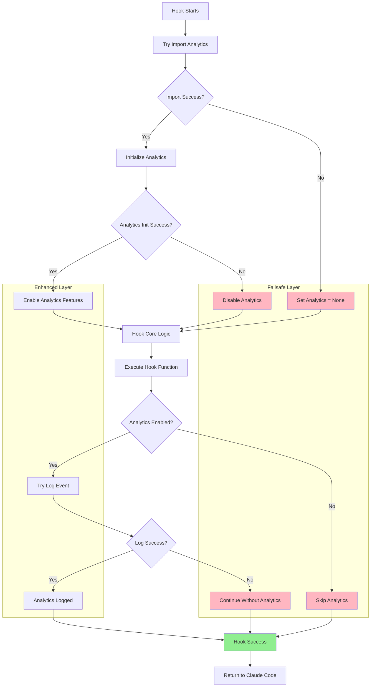

# Process Flow Documentation - Brainworm Architecture

This document provides comprehensive process flow diagrams using Mermaid to illustrate the architectural patterns and integration points within the brainworm system.

## Hook Independence Architecture

The following diagram shows how hooks maintain independence from the analytics system while providing optional integration points:



## Hooks Framework Lifecycle

This diagram illustrates the comprehensive lifecycle management provided by the Hooks Framework:



## Analytics Integration Points

This diagram shows the specific integration points between hooks and analytics, emphasizing the optional nature of the integration:



## Session Correlation Flow

This diagram illustrates the multi-strategy session correlation system with confidence scoring:



## DAIC Workflow Process

This diagram shows the DAIC workflow enforcement process with tool blocking logic:



## Transcript Processing Pipeline

This diagram shows the intelligent transcript processing system for subagent context delivery:

```mermaid
flowchart TD
    A[Task Tool Invoked] --> B[transcript_processor.py Triggered]
    B --> C[Read Claude Code Transcript]
    
    C --> D[Pre-work Removal]
    D --> E{First Edit/Write/MultiEdit Found?}
    E -->|Yes| F[Remove Everything Before First Tool]
    E -->|No| G[Keep Full Transcript]
    
    F --> H[Clean Transcript Format]
    G --> H
    
    H --> I[Convert to {role, content} Format]
    I --> J[Token-Aware Chunking]
    
    J --> K[18k Token Chunks with tiktoken]
    K --> L[Extract Subagent Type from Task Call]
    
    L --> M[Create Target Directory]
    M --> N[.brainworm/state/{subagent_type}/]
    
    N --> O[Save Numbered JSON Chunks]
    O --> P[transcript_chunk_1.json]
    O --> Q[transcript_chunk_2.json]
    O --> R[transcript_chunk_N.json]
    
    P --> S[Set Subagent Context Flag]
    Q --> S
    R --> S
    
    S --> T[in_subagent_context.flag]
    T --> U[Subagent Receives Context]
    
    U --> V[Task Execution with Full Context]
    V --> W[post_tool_use.py Cleanup]
    W --> X[Remove Subagent Flag]
    
    style A fill:#FFE4E1
    style B fill:#E6E6FA
    style T fill:#FFD700
    style U fill:#90EE90
```

## Configuration and Deployment Flow

This diagram illustrates the installation and configuration process:



## Analytics Data Flow

This diagram shows how analytics data flows through the system with optional collection:



## Error Handling and Failsafes

This diagram shows the comprehensive error handling that ensures hook independence:



## Key Architectural Insights

### Independence Guarantees
- Hooks function completely without analytics system
- Multiple failsafe layers prevent analytics failures from blocking hooks  
- Try/catch blocks around all analytics operations
- Graceful degradation when analytics components unavailable

### Integration Benefits
- Enhanced session correlation when analytics available
- Pattern learning and success prediction
- Real-time monitoring and alerting
- Cross-project organizational learning

### Performance Characteristics
- Hooks Framework overhead: <100ms with full analytics
- Analytics processing: Non-blocking background operations
- Database operations: Optimized with critical indexes
- Memory footprint: Minimal with efficient data structures

## Implementation Dependencies

### Critical Hook Configurations
The system requires specific hook configurations in `.claude/settings.json`:

```json
{
  "hooks": {
    "PreToolUse": [
      {
        "matcher": {"tools": ["Task"]}, 
        "hooks": [{"type": "command", "command": "uv run .brainworm/hooks/transcript_processor.py"}]
      },
      {
        "matcher": {"tools": ["Edit", "MultiEdit", "Write", "NotebookEdit"]}, 
        "hooks": [{"type": "command", "command": "uv run .brainworm/hooks/pre_tool_use.py"}]
      }
    ]
  }
}
```

### Installation Validation
- Task tool invocation should create transcript chunks in `.brainworm/state/{subagent_type}/`
- Implementation tools should be blocked in discussion mode
- Analytics database should be created at `.brainworm/analytics/hooks.db`
- Hooks Framework components should be installed in `.brainworm/hooks/utils/`

This process flow documentation provides a comprehensive view of how the brainworm system maintains hook independence while offering powerful analytics enhancements when available.